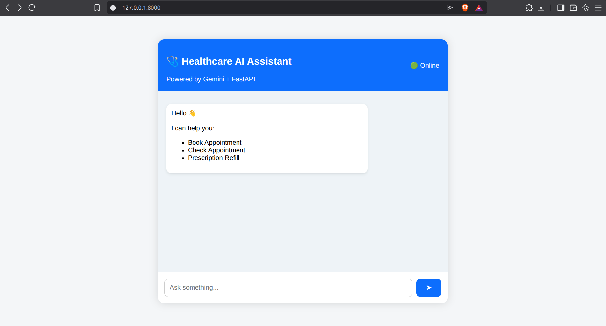
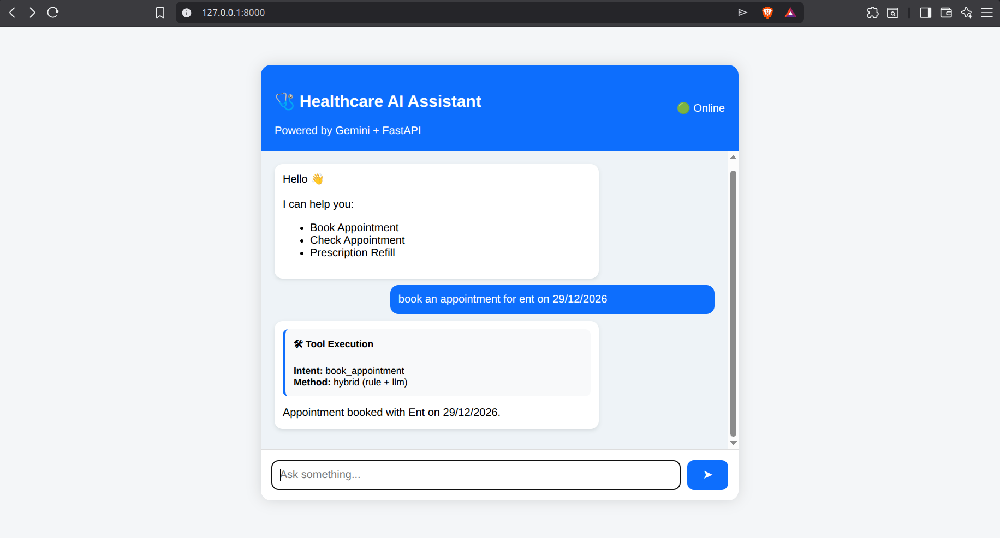
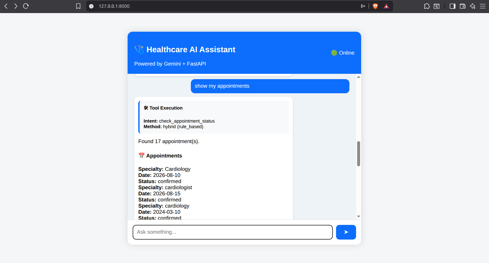
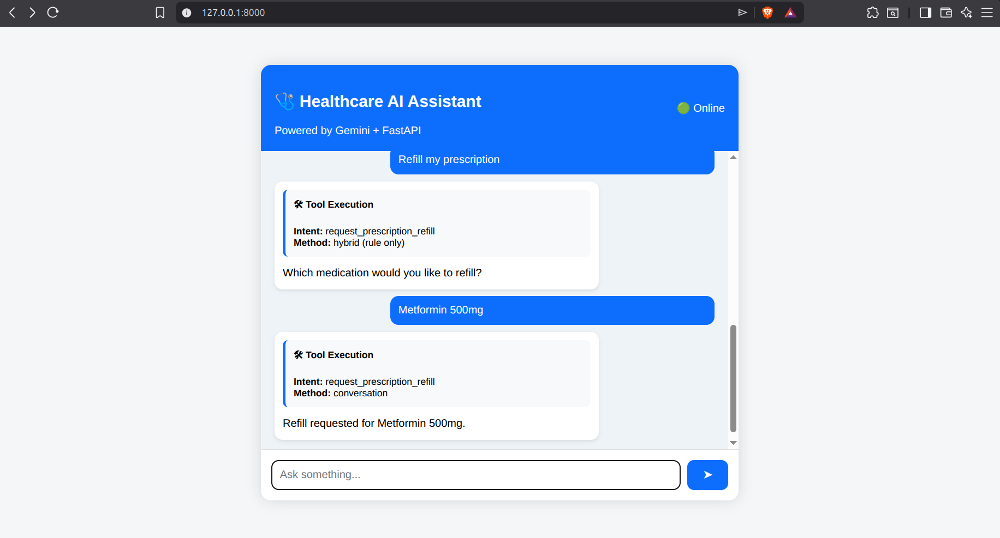
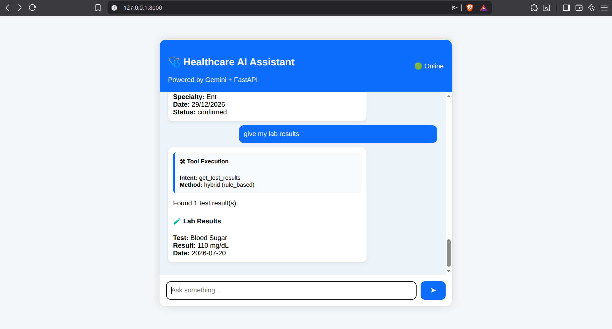
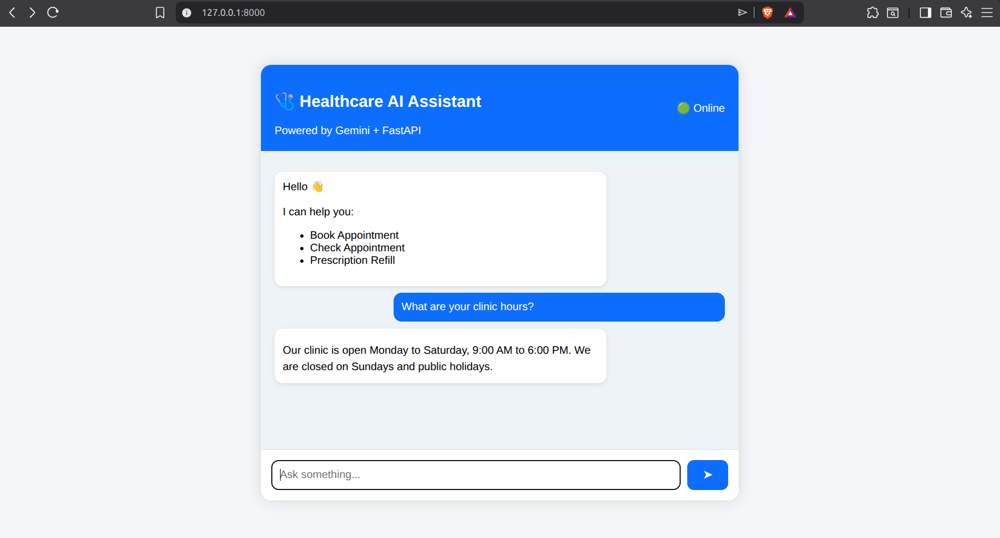
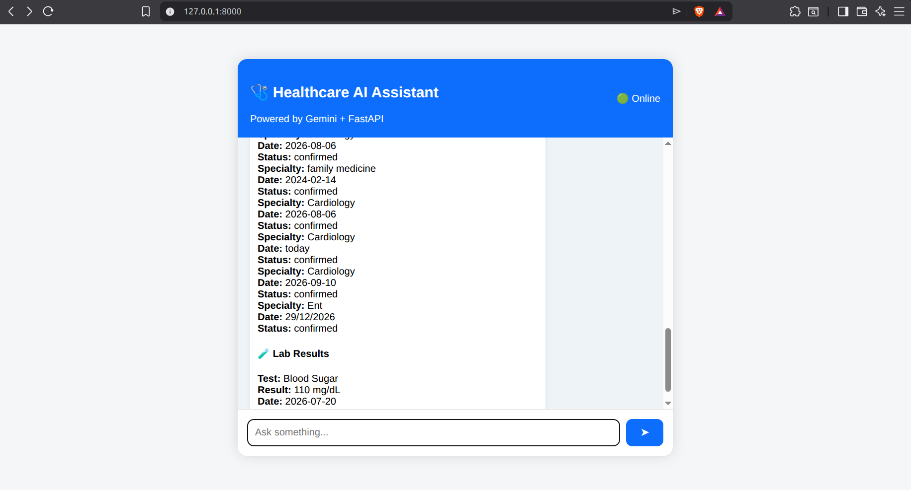

# 🩺 Healthcare AI Chatbot with Intelligent Tool Selection

An AI-powered Healthcare Chatbot built using **FastAPI**, **Python**, **Gemini/Groq LLMs**, **SQLite**, and **ChromaDB**.

The chatbot intelligently detects a user's intent, selects the correct healthcare tool, asks follow-up questions when required (slot filling), retrieves FAQ answers using Retrieval-Augmented Generation (RAG), and supports multi-turn conversations.

---

# 🚀 Features

✅ Hybrid Intent Detection (Rule-based + LLM)

✅ Intelligent Tool Selection

✅ Multi-turn Conversation

✅ Slot Filling

✅ Conversation Memory

✅ Prescription Refill

✅ Appointment Booking

✅ Appointment Status Checking

✅ Lab/Test Results Retrieval

✅ FAQ Retrieval using ChromaDB (RAG)

✅ Multi-Intent Support

✅ Modern Web Interface

---

# 📂 Project Structure

```
ai-chatbot-tool-selection/
│
├── app/
│   ├── conversation/
│   ├── intent/
│   ├── rag/
│   ├── services/
│   ├── tools/
│   ├── static/
│   ├── templates/
│   ├── db.py
│   └── main.py
│
├── chroma_db/
│
├── data/
│   └── faq_docs.md
│
├── tests/
│
├── healthcare.db
│
├── requirements.txt
│
└── README.md
```

---

# 🛠 Tech Stack

Backend

- Python
- FastAPI
- Uvicorn

Database

- SQLite

LLMs

- Google Gemini
- Groq

Embeddings

- sentence-transformers
- ChromaDB

Frontend

- HTML
- CSS
- JavaScript

---

# ⚙ Installation

## 1 Clone the Repository

```bash
git clone https://github.com/Arjunposni/ai-chatbot-tool-selection.git

cd ai-chatbot-tool-selection
```

---

## 2 Create a Virtual Environment

### Windows

```bash
python -m venv venv

venv\Scripts\activate
```

### Linux / macOS

```bash
python3 -m venv venv

source venv/bin/activate
```

---

## 3 Requirements

Before running the project, ensure you have:

- Python 3.11 or later
- Git
- A Gemini API key or a Groq API key
- Internet connection (for LLM API calls)

Install all dependencies using:

```bash
pip install -r requirements.txt
```

## 4 Create a .env File

Create a file named

```
.env
```

Example:

```env
LLM_PROVIDER=groq

GROQ_API_KEY=your_groq_api_key

GEMINI_API_KEY=your_gemini_api_key
```

You only need the API key for the provider you want to use.

To use Gemini:

```env
LLM_PROVIDER=gemini
```

To use Groq:

```env
LLM_PROVIDER=groq
```

---

# 📚 Build the FAQ Vector Database

Run this only once or whenever you modify:

```
data/faq_docs.md
```

```bash
python app/rag/faq_retriever.py
```

You should see:

```
Indexed XX FAQ entries.
```

---

# ▶ Run the Application

Start FastAPI:

```bash
uvicorn app.main:app --reload
```

Open your browser:

```
http://127.0.0.1:8000
```

---

# 💬 Example Queries

## Appointment Booking

```
Book an appointment
```

Bot

```
Which specialty would you like to book an appointment for?
```

User

```
Cardiology
```

Bot

```
What date would you prefer?
```

User

```
Tomorrow
```

Bot

```
Appointment booked successfully.
```

---

## Appointment Status

```
Show my appointments
```

---

## Prescription Refill

```
Refill my prescription
```

---

## Test Results

```
Show my lab results
```

---

## FAQ

```
What are your clinic hours?
```

---

## Multi Intent

```
Check my appointments and show my lab results
```

---

# 🧠 How the Chatbot Works

```
User
   │
   ▼
Hybrid Intent Detection
(Rule Based + LLM)
   │
   ▼
Parameter Extraction
   │
   ▼
Slot Filling
   │
   ▼
Conversation Memory
   │
   ▼
Tool Execution
   │
   ▼
SQLite Database
   │
   ▼
Formatted Response
```

If no healthcare tool matches the request:

```
User
   │
   ▼
RAG Search
(ChromaDB)
   │
   ▼
FAQ Answer
```

---

# 🧩 Healthcare Tools

The chatbot currently supports four tools.

### Book Appointment

Books a doctor's appointment.

Required Parameters

- patient_id
- specialty
- date

---

### Check Appointment Status

Shows all appointments.

Required Parameters

- patient_id

---

### Prescription Refill

Requests medication refills.

Required Parameters

- patient_id
- medication

---

### Test Results

Returns laboratory results.

Required Parameters

- patient_id

---

# 🗣 Multi-turn Conversation

The chatbot automatically remembers missing information.

Example

```
User:
Book appointment

Bot:
Which specialty?

User:
Cardiology

Bot:
What date?

User:
Tomorrow

Bot:
Appointment booked.
```

The conversation is automatically cleared once the task finishes.

Users can also cancel:

```
cancel
```

---

# 🔍 Retrieval-Augmented Generation (RAG)

The chatbot includes a lightweight RAG pipeline.

Workflow

```
User Question
      │
      ▼
Sentence Embedding
      │
      ▼
ChromaDB Search
      │
      ▼
Most Relevant FAQ
      │
      ▼
Answer Returned
```

FAQs are stored in

```
data/faq_docs.md
```

---

# 🧪 Testing

Run the automated intent detection tests.

```bash
python -m tests.run_test_cases
```

Example output

```
25 Tests Passed
```

---

# 📸 Screenshots

## 🏠 Home Screen



---

## 📅 Appointment Booking

Demonstrates multi-turn slot filling for booking an appointment.



---

## 📋 Appointment Status

Displays all appointments for the patient.



---

## 💊 Prescription Refill

Shows prescription refill using tool execution.



---

## 🧪 Lab Results

Displays the patient's lab/test results.



---

## 📚 FAQ / RAG

Answers healthcare FAQs using the ChromaDB knowledge base.



---

## 🔀 Multi-Intent Tool Calling

Single user query triggering multiple healthcare tools.



---

# 🔮 Future Improvements

- Authentication
- Multiple Patients
- Real Hospital APIs
- Doctor Availability
- Calendar Integration
- Email Notifications
- Voice Support
- Better Multi-intent Handling
- More Healthcare Tools

---

# 👨‍💻 Author

**Arjun Posni**

GitHub

https://github.com/Arjunposni

---

# ⭐ Acknowledgements

- FastAPI
- Google Gemini
- Groq
- ChromaDB
- Sentence Transformers

---

# 📄 License

This project was created as part of a technical assessment and is intended for educational and demonstration purposes.
